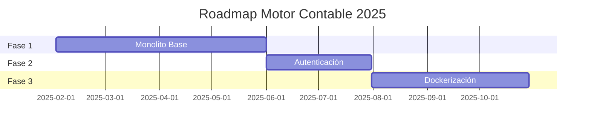

# Roadmap - Motor Contable Cloud-Native

## 🎯 Visión General

Desarrollar un motor contable empresarial basado en **Go/Fiber/go-dsl/PostgreSQL** con arquitectura evolutiva desde monolito hacia microservicios cloud-native. El sistema aprovecha el motor **go-dsl** existente para reglas contables flexibles.

## 📅 Timeline Estratégico



---

## 🚀 **FASE 1: MONOLITO GO/FIBER/DSL/POSTGRES** 
### **Febrero - Mayo 2025 (4 meses)**

### 📋 **Objetivo Principal**
Implementar **todas las APIs del mock funcional** usando:
- **Backend**: Go + Fiber + go-dsl + PostgreSQL
- **Sin autenticación** (endpoints públicos)
- **Mock funcional como especificación**

### 🏗️ **Arquitectura Base**

```
motor-contable/
├── cmd/
│   └── server/
│       └── main.go              # Punto de entrada
├── internal/
│   ├── api/                     # Handlers Fiber
│   │   ├── dashboard.go
│   │   ├── vouchers.go
│   │   ├── journal_entries.go
│   │   ├── accounts.go
│   │   └── reports.go
│   ├── domain/                  # Lógica de negocio
│   │   ├── vouchers/
│   │   ├── accounting/
│   │   └── reports/
│   ├── infra/                   # Infraestructura
│   │   ├── database/
│   │   ├── dsl/                 # Motor go-dsl
│   │   └── storage/
│   └── config/                  # Configuración
├── migrations/                  # SQL migrations
├── dsl/                         # Plantillas DSL
│   ├── templates/
│   └── examples/
└── docs/                        # Documentación
```

### 📦 **Entregables por Mes**

#### **Mes 1: Fundación**
- [x] **Estructura del proyecto Go**
- [x] **Setup Fiber con rutas básicas**
- [x] **Base de datos PostgreSQL 15+**
- [x] **Migración inicial del esquema**
- [ ] **Integración go-dsl básica**
- [ ] **API `/health` y `/metrics`**

#### **Mes 2: APIs Core**
- [ ] **Dashboard API** (`/api/dashboard`)
  - KPIs principales
  - Datos para gráficos Chart.js
  - Actividad reciente
- [ ] **Vouchers API** (`/api/vouchers`)
  - CRUD completo
  - Filtros y búsqueda
  - Validación de datos
- [ ] **Accounts API** (`/api/accounts`)
  - Plan de cuentas jerárquico
  - Tipos de cuenta

#### **Mes 3: Motor DSL y Contabilización**
- [ ] **Journal Entries API** (`/api/journal-entries`)
  - Generación automática vía DSL
  - Balance automático
- [ ] **Motor go-dsl integrado**
  - Plantillas para tipos de comprobante
  - Runtime de ejecución
  - Cache de plantillas compiladas
- [ ] **DSL Editor API** (`/api/dsl`)
  - CRUD de plantillas
  - Validación y pruebas

#### **Mes 4: Reportes y Consolidación**
- [ ] **Reports API** (`/api/reports`)
  - 12 tipos de reportes
  - Generación PDF/Excel
  - Parámetros configurables
- [ ] **Catálogos API** (`/api/catalogs`)
  - Países, monedas, tipos
  - Configuración multi-tenant
- [ ] **Testing y documentación completa**
- [ ] **Deploy en servidor local**

### 🎯 **KPIs Fase 1**
- ✅ **13 APIs implementadas** (100% mock coverage)
- ✅ **5 plantillas DSL funcionales**
- ✅ **1,000 comprobantes/día procesados**
- ✅ **Latencia < 200ms por request**
- ✅ **Cobertura de tests > 80%**

### 📊 **APIs a Implementar** (del catalog_api.json)

| **Módulo** | **Endpoints** | **Estado** |
|------------|---------------|------------|
| Dashboard | `/api/dashboard` | ⏳ |
| Vouchers | `/api/vouchers/*` | ⏳ |
| Journal | `/api/journal-entries/*` | ⏳ |
| Accounts | `/api/accounts/*` | ⏳ |
| Reports | `/api/reports/*` | ⏳ |
| DSL | `/api/dsl/*` | ⏳ |
| Catalogs | `/api/catalogs/*` | ⏳ |

---

## 🔐 **FASE 2: AUTENTICACIÓN Y AUTORIZACIÓN**
### **Junio - Julio 2025 (2 meses)**

### 📋 **Objetivo Principal**
Agregar **seguridad completa** manteniendo todas las funcionalidades:
- **JWT Authentication**
- **RBAC (Role-Based Access Control)**
- **Multi-tenant básico**

### 🔧 **Entregables**

#### **Mes 5: Sistema de Autenticación**
- [ ] **JWT middleware** en Fiber
- [ ] **APIs de autenticación**
  - `/api/auth/login`
  - `/api/auth/register` 
  - `/api/auth/refresh`
  - `/api/auth/logout`
- [ ] **Modelo de usuarios y roles**
- [ ] **Hash de contraseñas (bcrypt)**

#### **Mes 6: Autorización y Multi-tenant**
- [ ] **RBAC middleware**
  - Admin, Manager, User, Viewer
  - Permisos granulares por endpoint
- [ ] **Tenant isolation básico**
  - Organización por usuario
  - Filtrado automático por tenant_id
- [ ] **UI de login** actualizada
- [ ] **Token refresh automático**

### 🎯 **KPIs Fase 2**
- ✅ **100% endpoints protegidos**
- ✅ **4 roles configurados**
- ✅ **Session management funcional**
- ✅ **0 vulnerabilidades de seguridad**

---

## 🐳 **FASE 3: DOCKERIZACIÓN Y CLOUD-READY**
### **Agosto - Octubre 2025 (3 meses)**

### 📋 **Objetivo Principal**
Preparar el sistema para **producción en la nube**:
- **Containerización completa**
- **CI/CD pipeline**
- **Monitoring y observabilidad**

### 🚀 **Entregables**

#### **Mes 7: Containerización**
- [ ] **Dockerfile optimizado**
  - Multi-stage build
  - Imagen Alpine < 50MB
- [ ] **Docker Compose** completo
  - App + PostgreSQL + Redis
  - Volúmenes persistentes
- [ ] **Health checks** en containers
- [ ] **Environment-based config**

#### **Mes 8: CI/CD y Testing**
- [ ] **GitHub Actions pipeline**
  - Build + Test + Security scan
  - Deploy automático
- [ ] **Testing avanzado**
  - Integration tests
  - Load testing (1K RPS)
  - Security testing
- [ ] **Database migrations** automáticas

#### **Mes 9: Observabilidad y Producción**
- [ ] **Monitoring stack**
  - Prometheus + Grafana
  - Alertas automáticas
- [ ] **Logging centralizado**
  - Structured logging
  - Log aggregation
- [ ] **Deploy en cloud** (AWS/GCP/Azure)
  - Load balancer
  - Auto-scaling básico
- [ ] **Backup automático** de DB

### 🎯 **KPIs Fase 3**
- ✅ **Deploy time < 5 minutos**
- ✅ **99.9% uptime**
- ✅ **Rollback automático en fallos**
- ✅ **Monitoring 24/7 operativo**

---

## 🎯 **Hitos Críticos**

### **Mayo 2025 - Final Fase 1**
- ✅ **Mock funcional → API real** (100%)
- ✅ **go-dsl motor integrado**
- ✅ **PostgreSQL optimizado**

### **Julio 2025 - Final Fase 2**  
- ✅ **Login/logout funcional**
- ✅ **RBAC implementado**
- ✅ **Multi-tenant básico**

### **Octubre 2025 - Final Fase 3**
- ✅ **Producción cloud-ready**
- ✅ **CI/CD completo**
- ✅ **Monitoring operativo**

---

## 📈 **Stack Tecnológico Definitivo**

### **Backend Core**
- **Lenguaje**: Go 1.21+
- **Framework**: Fiber v2
- **DSL Engine**: go-dsl (existing)
- **Base de datos**: PostgreSQL 15+
- **Cache**: Redis (Fase 3)

### **DevOps & Infrastructure**
- **Containerización**: Docker + Docker Compose
- **CI/CD**: GitHub Actions
- **Cloud**: AWS/GCP/Azure (multi-cloud ready)
- **Monitoring**: Prometheus + Grafana
- **Logging**: Structured JSON logs

### **Frontend (existente)**
- **UI**: HTML5 + CSS3 + Vanilla JS
- **Charts**: Chart.js
- **API Client**: Fetch API + api_service.js

---

## 🚧 **Riesgos y Mitigaciones**

### **Fase 1 - Riesgos Técnicos**
1. **Complejidad go-dsl**
   - ✅ **Mitigación**: go-dsl ya existe y funciona
   - Usar plantillas del mock como guía

2. **Performance PostgreSQL**
   - ✅ **Mitigación**: Índices optimizados + EXPLAIN ANALYZE
   - Particionamiento si es necesario

### **Fase 2 - Riesgos Seguridad**
1. **JWT vulnerabilities**
   - ✅ **Mitigación**: Librerías probadas + short expiry
   - Refresh token rotation

### **Fase 3 - Riesgos Operacionales**
1. **Downtime en deploy**
   - ✅ **Mitigación**: Blue-green deployment
   - Health checks + rollback automático

---

## 📊 **Métricas de Éxito por Fase**

### **Fase 1 - Funcionalidad**
- Mock → API: 100% feature parity
- Performance: < 200ms response time
- DSL: 5 templates funcionando
- Tests: > 80% coverage

### **Fase 2 - Seguridad**  
- Auth: 100% endpoints protegidos
- RBAC: 4 roles configurados
- Sessions: Token expiry configurado
- Security: 0 vulnerabilidades críticas

### **Fase 3 - Operación**
- Deploy: < 5 min deployment time
- Uptime: > 99.9% availability  
- Monitoring: 100% metrics coverage
- Scaling: Auto-scale funcional

---

## 💡 **Siguientes Pasos Post-Fase 3**

### **Q4 2025 - Escalabilidad**
- Microservicios específicos
- NATS JetStream
- Kubernetes

### **Q1 2026 - Multi-País**
- Plantillas DSL por país
- Cumplimiento normativo
- 6 países LATAM

### **Q2 2026 - Inteligencia**
- ML para categorización
- Analytics avanzado
- Automatización

---

*Última actualización: Enero 2025*  
*Versión: 2.0 - Roadmap Implementación*